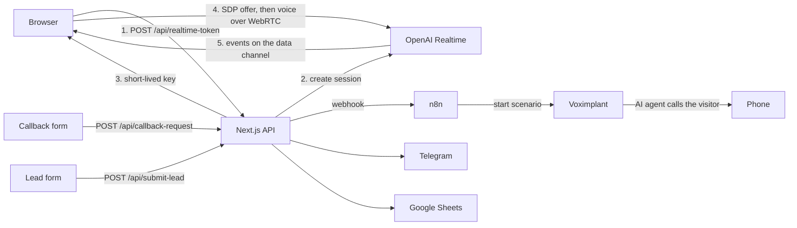

# AI voice website

[](https://github.com/ahrimmedia-beep/ahrim-ai-lab-site/actions/workflows/ci.yml)

The website of my AI automation agency, Ahrim AI Lab, with live voice agents built in. A visitor presses a button and talks to an AI agent right in the browser, with no app and no phone call. The site has two demo agents for a real estate agency: an outbound sales caller and an inbound receptionist. A visitor can also leave a phone number, and the outbound agent calls them back on a real phone line.

## The problem

A voice agent is hard to sell with text and screenshots. A client wants to hear it first. A phone demo needs a number and a call at the right time.

A browser demo has a technical problem. Most visitors use laptop speakers, not headphones. The agent hears its own voice through the microphone and cuts itself off in the middle of a sentence.

## What I built

- The agency website: landing page, lead forms, legal pages, sitemap and analytics goals.
- Voice calls in the browser on the OpenAI Realtime API over WebRTC. Audio goes straight between the browser and OpenAI.
- Two demo agents with their own voices. They collect the lead with a function call, the page shows it live, and the agent hangs up by itself after the goodbye.
- Echo protection, so a call works on laptop speakers. Details below.
- A phone callback. The site sends the number to an n8n workflow, and n8n starts a Voximplant scenario in which the AI agent calls the visitor.
- Lead forms that send each request to Telegram and Google Sheets.
- Guards on the endpoints that cost money: a daily per-IP limit on voice sessions, a one-minute per-IP cooldown on callbacks and a honeypot field against bots.

## How it works



The OpenAI key stays on the server. The token route creates a short-lived key for the call. The browser sends its SDP offer to OpenAI with that key, and from then on the voice goes directly between the browser and OpenAI. The server carries no audio.

OpenAI sends events back over a WebRTC data channel: transcripts, tool calls and the end of each response. The hook parses each event and passes it to a pure reducer. The reducer returns the next phase of the call and a list of effects, such as "send this event", "open the mic in 600 ms" or "save the lead". The hook only runs the effects, so the call logic is tested in Node without a browser.

### Echo protection

Speakers feed the agent's voice back into the microphone. The call guards against it in layers:

1. The session starts with voice activity detection (VAD) off, so nothing the mic picks up can interrupt the agent.
2. The agent's audio plays through a plain `<audio>` element with no Web Audio processing, so the browser's echo canceller keeps its reference signal.
3. The agent speaks first. The page waits until the data channel is open and 800 ms have passed since the agent's audio track arrived.
4. The mic is off during the greeting.
5. After the greeting the page clears the input buffer, waits 600 ms, turns on VAD with a high threshold and no barge-in, and then opens the mic.
6. After the first real user turn, barge-in is allowed.

## Selected code

This repository holds a few real modules from the site, with their tests, to show how the code is written. The agent prompts and personas, the site copy, the n8n and Voximplant setup and the deployment stay private. Comments are translated to English.

| File | What it shows |
|---|---|
| [`src/realtime-events.ts`](src/realtime-events.ts) | Parsing of OpenAI Realtime events from the data channel and a pure reducer for the echo-safe call flow: greeting, guarded listening, barge-in. Builders for the events the page sends. |
| [`src/call-state.ts`](src/call-state.ts) | Call rules: start guard, timer and time limit, network drop detection, a headphones hint and mapping of microphone errors to a message for the visitor. |
| [`src/callback-request.ts`](src/callback-request.ts) | The phone callback request: zod validation, a honeypot, a per-IP cooldown and the n8n webhook call, which never throws. |
| [`examples/useWebRTCVoice.ts`](examples/useWebRTCVoice.ts) | The React hook that runs a call: microphone, session token, peer connection, SDP exchange, data channel and cleanup. It is built on the modules above. |
| [`examples/callback-request-route.ts`](examples/callback-request-route.ts) | The Next.js route behind the callback form. |

```bash
npm install
npm test           # 73 tests, Node 22.18+
npm run typecheck
```

## Stack

Next.js 16 (App Router), React 19, TypeScript, Tailwind CSS 4, Framer Motion, zod, OpenAI Realtime API over WebRTC (gpt-realtime-mini), n8n, Voximplant, Telegram Bot API, Google Sheets, Docker.

## My role

I built the project alone: design, frontend, backend, the voice agents, the n8n and Voximplant callback flow and deployment.

## License

Published for viewing only. All rights reserved, see [LICENSE](LICENSE).
